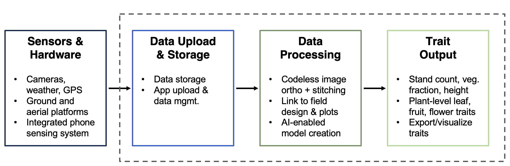

# 🌱 GxExMINI Phenotyping App


---

## 🔗 Overview

**GxExMINI** is a web-based phenotyping platform designed to accelerate the development of nutritious, stress-resistant staple crops in low- and middle-income countries. The application features a *React.js frontend* and a *Flask backend*, offering a seamless interface for breeders, researchers, and data scientists.

We aim to improve the speed and quality of crop breeding by using affordable, multi-modal sensors and machine learning to rapidly collect high-resolution phenotypic data.

---

## 📚 Resources

- 📝 [**Full Documentation**](https://gemini-breeding.github.io/)  
- 📂 [**Example Data**](https://ucdavis.box.com/s/ts802xlcddyufixfjmeayxwiiz2mxrb9)

---

## ⚙️ Installation

```bash
# Step 1: Initialize submodules
git submodule update --init --recursive

# Step 2: Set up Flask backend
cd GEMINI-Flask-Server
./install_flask_server.sh
cd ../

# Step 3: Install Node Version Manager (NVM)
curl -o- https://raw.githubusercontent.com/nvm-sh/nvm/v0.39.5/install.sh | bash
source ~/.bashrc

# Step 4: Install Node 18 and switch to it
nvm install 18
nvm use 18

# Step 5: Install frontend dependencies
cd gemini-app
npm install --legacy-peer-deps  # Fixes upstream dependency conflict

## 🌾 Pipeline Overview



```

---

## 🔍 Pipeline Overview


- **File Management System** – Easily organize and access raw and processed data.
- **Codeless Image Orthomosaic Process** – Generate field-scale mosaics without writing code.
- **Linked Data Visualization** – Visualize data with direct links to field design layouts.
- **AI-Enabled Model Creation** – Train and deploy machine learning models for trait analysis.
- **Trait Extraction & Export** – Extract key traits and export results for downstream use.

