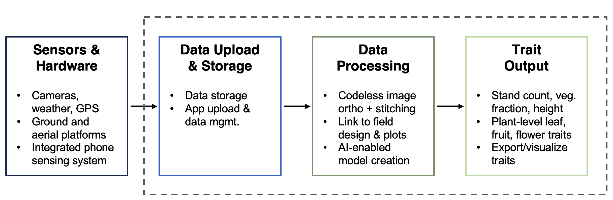

# 🌱 GxExMINI Phenotyping App


---

## 🔗 Overview

**GxExMINI** is a high-throughput phenotyping platform designed to accelerate the development of nutritious, stress-resistant staple crops. The platform includes:

- **Desktop Application:** Built with [Tauri v2](https://tauri.app) (Rust), React 18, and a FastAPI/SQLite backend.
- **Automated Processing Pipelines:** Support for both aerial and ground-based data.
- **Advanced Analytics:** Feature-rich interface for mapping, trait extraction, and data querying.

For more information about the project and our research, visit: [https://projectgemini.ucdavis.edu/](https://projectgemini.ucdavis.edu/)

---

## 📚 Resources

- 📝 [**Full Documentation & User Guides**](https://gemini-breeding.github.io/)  
- 📂 [**Example Data**](https://ucdavis.box.com/s/ts802xlcddyufixfjmeayxwiiz2mxrb9)

---

## ⚙️ Installation & Setup

### Development Environment
For active development on the Tauri/React/FastAPI stack, please refer to the **[Developer Guide](https://gemini-breeding.github.io/start_guide/developer_guide.md)** in our official documentation.

**Quick start:**
```
# 1. Clone with submodules
git clone --recurse-submodules https://github.com/GEMINI-Breeding/GEMINI-App.git
cd GEMINI-App

# 2. Setup Backend (uv)
cd backend
uv sync

# 3. Setup Frontend
cd ../frontend
npm install
```

### Building for Production
See [`docs/BUILDING.md`](./docs/BUILDING.md) for platform-specific build instructions (Linux, macOS, Windows).

---

## 🔍 Pipeline Overview



- **File Management System** – Effortlessly organize, verify, and sync metadata for raw and processed data.
- **Aerial Pipeline** – Full workflow for drone imagery, from GPS sync and GCP alignment to orthomosaic generation and trait extraction.
- **Ground Pipeline** – Purpose-built pipeline for rover-based (Amiga) data, featuring custom plot marking, image stitching, and inference model execution.
- **Linked Data Visualization** – Visualize data with direct links to field design layouts via the **Analyze** tab.
- **AI-Enabled Analysis** – Integration with RoboFlow for computer vision tasks (object detection and segmentation).
- **Trait Extraction & Export** – Compute and export key plant traits (e.g., height, vegetation fraction) for downstream research.
